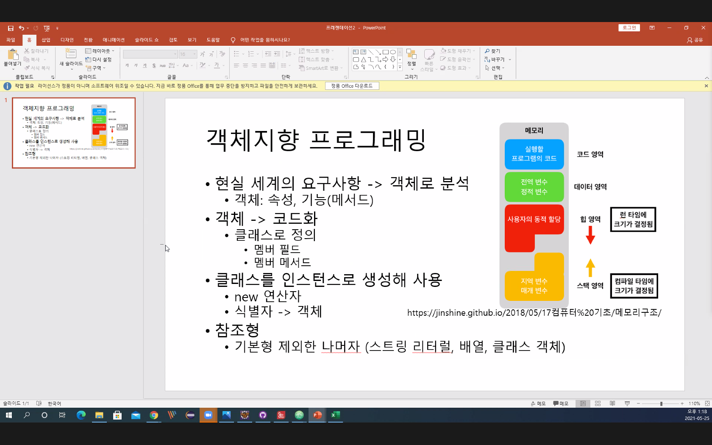

# 객체지향 프로그래밍

- 객체
    1. 객체: 객체 지향 프로그램의 대상, 생성된 인스턴스

    2. 클래스: 객체를 프로그래밍 하기 위해 코드로 상태

    3. 인스턴스: 클래스가 메모리에 생성된 상태

    4. 멤버 변수: 클래싀의 속성, 특성

    5. 메서드: 멤버 변수를 이용하여 클래스의 기능을 구현

    6. 참조 변수: 메모리에 생성된 인스턴스를 가리키는 변수

    7. 참조 값: 생성된 인스턴스의 메모리 주소 값.

# 객체지향 클래스




## class method

Main class
```java
package com.osh.m5d25;

public class MethodTestMain {

	public static void main(String[] args) {

		MethodClass m = new MethodClass();

		int r = m.add(10, 100);

		m.add(10, 100); // return 값을 안 받을수도 있다.

		m.getTenTotal();

		m.printTenTotal();

		m.printGreeting("hahaha");

		m.divide(100, 1);

		m.divide(100, 0);


	}

}

```
## Method class

```java
package com.osh.m5d25;

public class MethodClass {

	public int add(int i1, int i2) {
		int result;
		result = i1 + i2;
		return result;
		// return i1 + i2;
	}


	public int getTenTotal() {
		return 10*10; // 값만 반환
	}


	public void printTenTotal() {
		int total = getTenTotal();
		System.out.println(total);
		// return; 생략 가능.
	}

	public void printGreeting(String name) {
		System.out.println("Hello" + name);
		return; // 반환 값이 없다는 의미. void.
	}

	public void divide(int num1, int num2) {
		if(num2 == 0) {
			System.out.println("나누는 수는 0이 될 수 없습니다.");
			return; // 함수 수행 종료. break 와 유사.
		} else {
			int result = num1/ num2;
			System.out.println(result);
		}
	}
}

```

## StudentClass

```java
package com.osh.m5d25;

public class Student {

	// 멤버필드(변수, 식별자): 속성
	int studentID;
	String studentName;
	int grade;
	String address;
	int score;

	// 멤버 메서드 : 함수

	// 1. 클래스 안에서만 존재.

	// 2. 반환형식이 있다.
	public String showStudentInfo() {
		//이름/아이디/주소
		String info = studentName + "/" + studentID + "/" + address;
		return info;
	}

	// 3. 반환이 없을수 있다: void
	// 클래스 내부에서 연산/계산/처리 => 클래스 내부에 저장... 출력
	public void println() {
		String info = studentName + "/" + studentID + "/" + address;
		System.out.println(info);
	}

	// 4. 매개변수를 사용.
	// -> 점수 전달, 처리, info로 반환.
	public String setScore(int score) {
		this.score = score;
		String info = showStudentInfo();
		return info + "/score = " + this.score;
	}

	public void setScore2(int score) {
		this.score = score;
	}
}

```

## Student Main Class

```java
package com.osh.m5d25;
// import com.osh.day8_Exam.Student;

import com.osh.m5d25_sub.Person;

public class Chapter5Main {

	// public static  <<< static은 main클래스에서 메서드들이 사용하는것인데 일반적인 클래스 파일에서는 쓰지 않는다.
	// 그리고 메인 클래스에서 메서드를 만드는것은 되도록 하지 않는다.
	public static void main(String[] args) {
		Student st = new Student(); // com.osh.m5d25.Student;
		// com.osh.day8_Exam.Student st2 = new Student();
		// 클래스를 객체화 시키면 . operator 로 클래스 안의 멤버필드/멤버 매서드에 접근이 가능하다.

		// 다른 패키지의 클래스를 가져왔을때, 멤버 필드를 . operator로 접근이 불가능하다.
		Person p = new Person();

		st.studentID = 1000; // 웬만하면 이런식으로 직접적으로 변경을 못하게 한다. (접근 통로를 줄인다.)
		st.studentName = "홍길동"; // 불안정함 없애기위해. 메서드를 통해 바꿀수 있도록 제공하는게 좋다.


		// 사용
		System.out.println(st.studentName);

		// 2. 반환형식이 있다.
		String info = st.showStudentInfo();
		System.out.println(info);

		//System.out.println(st.showStudentInfo());

		// 3. 반환형식이 없다.
		st.println();

		// 4. 매개변수를 사용.
		System.out.println(st.setScore(100));

		// 아래 방식을 더 많이 사용한다.
		st.setScore2(100);
		System.out.println( st.showStudentInfo() );

		// 다른 패키지의 클래스 파일.
		//com.osh.day8_Exam.Student st3 = new com.osh.day8_Exam.Student();

	}

}

```

# 모든 클래스에는 Default 생성자가 있다.

Default class = new Default();
구문에서 Default클래스안에

```java
public Person(){

}
```
이라고 하는 메서드가 자동으로 만들어진다.
이것을 Default 생성자라고 하고, new Default(); 가 부르는 메서드이다.
기본적으로 Default 생성자는 자동으로 만들어지지만, 직접 만들수도 있다.

```java
package com.osh.m5d25;

public class DefaultNewPersonMain {

	public static void main(String[] args) {
		DefaultNewPerson p = new DefaultNewPerson();

		DefaultNewPerson p2 = new DefaultNewPerson();

		DefaultNewPerson p3 = new DefaultNewPerson();

	}

}

```

```java
package com.osh.m5d25;

public class DefaultNewPerson {
	String name;
	float height;
	float weight;


	// 특별한 메소드.(디폴트 생성자)
	// class 이름과 같다.
	// return 타입 X
	public DefaultNewPerson() {
		System.out.println("생성자");
	}
}

```

위의 코드 값으로 콘솔에 "생성자"가 3번 찍힌다.


그리고 생성자 메서드는 기본적으로 클래스가 인스턴스화 할때
멤버 변수의 초기값을 준다.

생성자 메서드를 직접 만들경우 초기값을 직접 지정할수있다.

또한 생성자 메서드도 일반 메서드처럼 매개변수를 가질수 있다.

### main
```java
package com.osh.m5d25;

public class DefaultNewPersonMain {

	public static void main(String[] args) {
		DefaultNewPerson p = new DefaultNewPerson();

		DefaultNewPerson p2 = new DefaultNewPerson();

		DefaultNewPerson p3 = new DefaultNewPerson();

		DefaultNewPerson p4 = new DefaultNewPerson("홍길동");

		DefaultNewPerson p5 = new DefaultNewPerson("자바");

		DefaultNewPerson p6 = new DefaultNewPerson("도넛");

		DefaultNewPerson p7 = new DefaultNewPerson("홍길동",6,5);

		DefaultNewPerson p8 = new DefaultNewPerson("자바",7,8);

		DefaultNewPerson p9 = new DefaultNewPerson("도넛",9 ,10);

	}

}

```
### PersonClass
```java
package com.osh.m5d25;

public class DefaultNewPerson {
	String name;
	float height;
	float weight;


	// 특별한 메소드.(디폴트 생성자)
	// class 이름과 같다.
	// return 타입 X
	public DefaultNewPerson() {
		height = 0;
		weight = -1;

		System.out.println("Person 생성자" + "w: "+ weight + "   h:"+ height);
	}

	// 2 매개변수 생성자
	public DefaultNewPerson(String n) {
		name = n;
		System.out.println(name + ": " + "w: "+ weight + "   h:"+ height);
	}
	public DefaultNewPerson(String n, float w, float h) {
		name = n;
		height = h;
		weight = w;
		System.out.println(name + ": " + "w: "+ weight + "   h:"+ height);
	}
}

```
### 결과값

- Person 생성자w: -1.0   h:0.0
- Person 생성자w: -1.0   h:0.0
- Person 생성자w: -1.0   h:0.0
- 홍길동: w: 0.0   h:0.0
- 자바: w: 0.0   h:0.0
- 도넛: w: 0.0   h:0.0
- 홍길동: w: 6.0   h:5.0
- 자바: w: 7.0   h:8.0
- 도넛: w: 9.0   h:10.0
